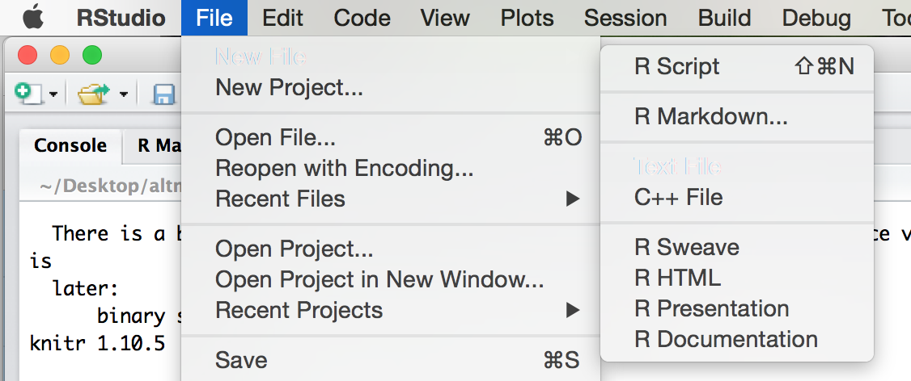
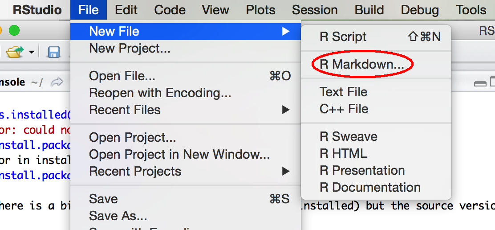
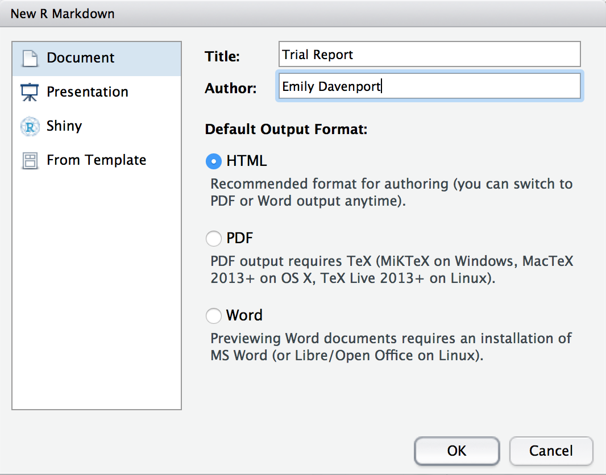
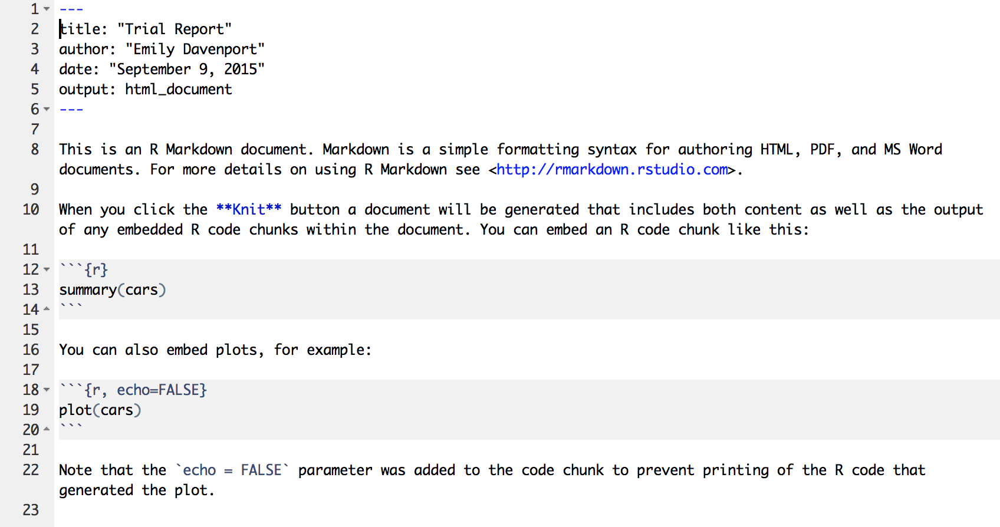
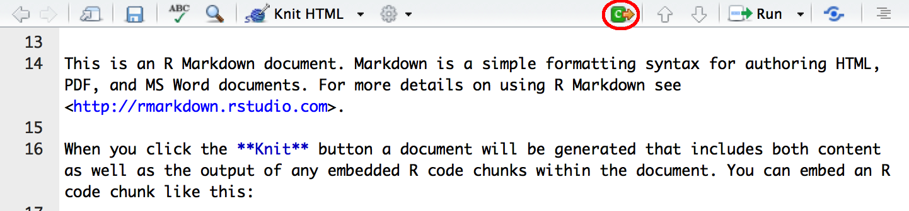
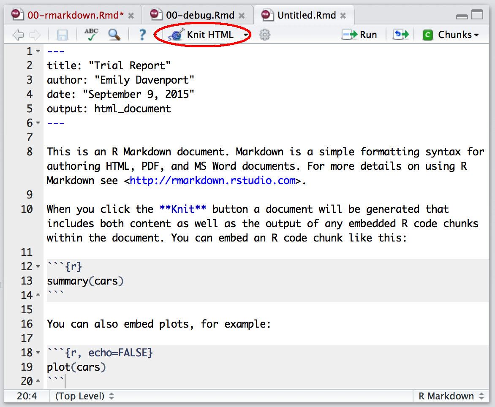

```{r, echo=FALSE, purl=FALSE, message = FALSE, results='hide'}
source("setup.R")
if (file.exists("portalR.db")) file.remove("portalR.db")
```

> ## Learning Objectives
>
> * Learn the basics of Markdown syntax
> * Learn how to generate reproducible reports that display your code and results
> * Learn how format chunks in R Markdown to display only the information you want to display.

------------

When you perform wet lab experiments, what information do you put in your lab notebook? 
You probably include the protocol you used to run the experiment, information about the samples and reagents used in the protocol, and at the end you'll likely include your results (for instance, a picture of a gel). 
This essentially creates a report of your experiment.  

You can do the same with your dry lab analyses using a tool called R Markdown. 
Why would we want to do this?  

*  Your method, results, and interpretation are stored in one place  
*  If you update your methodology, you can easily update your results with the click of a button, rather than copying and pasting.   
*  You _could_ cut and paste your code and results into Word or Power Point, but that will make rerunning your code challenging, as Word often introduces hidden characters.  

R Markdown is a fairly simple language you can use to generate reports that incorporate bits of R code along with the output they produce.
There are two steps to generating reports with R Markdown and RStudio:

1) Write your code in R Markdown.
2) Assemble your report as either HTML or a PDF using the package knitr.  

Before we get started, let's make sure everyone has the rmarkdown package installed:

```{r eval=FALSE}
install.packages('rmarkdown')
```

RMarkdown is a language that combines the abilities to run R code (called "chunks") along with documenting your code. 
In the end, you get a single document with descriptions, code blocks, and figures all mixed together.
In the description section of an Rmarkdown document, you have the ability bold words, create headers, lists, or hyperlinks using a language called Markdown.  

# Markdown syntax

Let's learn some markdown basics by creating a README file for your dissertation. 

Now let's start our new README document. 
Go up to `File` -> `New File` -> `Text File`. 



This opens an untitled document that you can see is just blank.

Before we get started, let's save it as our README file in our project directory. 
Go to `File` -> `Save As`, and call the file README.md. 
The file ending .md indicates that it is a markdown file. 

Let's start adding some information to our file:

```
README

6/14/16 Emily Davenport

This directory contains information from my amazing dissertation. 
```

Once that is entered, click on the `Preview HTML` button.
A page should pop up that displays our short README file. 

This is fine, but let's start adding some flash. 
First, let's make the first line a header. 
To make headers in Markdown, you can use varying numbers of hashtags at the beginning of a line. 
The fewer the hashtags, the larger the font. 

Put varying numbers of hashtags in front of README and click `Preview HTML`. 
Figure out which header size you like most and update that file to have that header. 

Your file should now look something like this:

```
# README

6/14/16 Emily Davenport

This directory contains information from my amazing dissertation. 
```

New paragraph spacing works a bit differently in Markdown than what you may be used to. 
Let's add some additional information about what is included in this folder, with the intention of having each entry on a new line:

```
# README

6/14/16 Emily Davenport

This directory contains information from my amazing dissertation. 
data files
scripts
results
```

That's not what we wanted.
To indicate you want to start on a new line, you need to put two spaces at the end of the current line.
Go back and add two spaces after including, data files, scripts, and results.

```
# README

6/16/16 Emily Davenport

This directory contains information from my amazing dissertation.   
data files  
scripts  
results  
```

If you hit the return button twice, it will create a paragraph break with white space. 

It would look a bit nicer if our list had bullet points in front of each entry rather than just being on a new line. 
Using Markdown, you can indicate list entries using either "-", "+", or "*" in front of each item. 
In our script, add a return after the "including:" and add asterisks in front of each item in our list. 
Generate the HTML to see our formatted list. 

```
# README

6/14/16 Emily Davenport

This directory contains information from my amazing dissertation. Including:  

*  data files  
*  scripts  
*  results  
```

You can also include asterisks or underlines on either side of selections you want to bold or underline, respectively.
Let's bold the word amazing, and italicize including:


```
# README

6/14/16 Emily Davenport

This directory contains information from my **amazing** dissertation. _Including_:  

*  data files  
*  scripts  
*  results  
```

You can also include code boxes in Markdown, which will designate to the reader what exactly to run. 
Anything between two backticks (located under the tilde on your keyboard) will be rendered as a code block.
Let's include a code box in the README about how to view the README. 

```
# README

6/14/16 Emily Davenport

This directory contains information from my **amazing** dissertation. _Including_:  

*  data files  
*  scripts  
*  results  

To view this README, type `cat README.md`.
```

In addition to inline code, which can be useful for highlighting when a word is a program or function, you can include code blocks. 
Code blocks can be useful for either separating single line commands from description or for including multiline commands. 
A code block starts and ends with three backticks, with every line in between being included in the code block. 
For instance, let's add instructions on how to install the rmarkdown package to our readme:

~~~
# README

6/14/16 Emily Davenport

This directory contains information from my **amazing** dissertation. _Including_:  

*  data files  
*  scripts  
*  results  

To view this README, type `cat README.md`.

To ensure the rmarkdown package is installed, in R type the following:

```
install.packages("rmarkdown")
```
~~~

Finally, it's always useful to explain when and where you downloaded your data from in your readme. 
We can include hyperlinks in markdown in two ways. 
First, you can enclose the words that you want to be hyperlinked in brackets, and include the URL in parenthases immediately behind it. 
Let's add the original source of our ecology data to our README using this method:

~~~
# README

6/14/16 Emily Davenport

This directory contains information from my **amazing** dissertation. _Including_:  

*  data files  
*  scripts  
*  results  

To view this README, type `cat README.md`.

To ensure the rmarkdown package is installed, in R type the following:

```
install.packages("rmarkdown")
```

The data for this project originally came from the [Portal Project Teaching Database](https://figshare.com/articles/Portal_Project_Teaching_Database/1314459)
~~~

The second method is helpful if you have many links in your document or want to reference the same URL multiple times. 
You can create reference-style links, where you create a tag for each link that you then include in brackets after the words you wish to hyperlink. 
We downloaded two datasets for this workshop from the workshop repository. 
Let's include links to that data using reference style hyperlinking:

~~~
# README

6/14/16 Emily Davenport

This directory contains information from my **amazing** dissertation. _Including_:  

*  data files  
*  scripts  
*  results  

To view this README, type `cat README.md`.

To ensure the rmarkdown package is installed, in R type the following:

```
install.packages("rmarkdown")
```

The data for this project originally came from the [Portal Project Teaching Database](https://figshare.com/articles/Portal_Project_Teaching_Database/1314459)

The data files were downloaded 6/14/16, including both [species level data][link1] and [plot level data][link2]

[link1]: https://ndownloader.figshare.com/files/2292169
[link2]: https://ndownloader.figshare.com/files/3299474
~~~

We've now generated a slightly more stylized version of a README using Markdown, which includes useful information about when and where we downloaded our data.
Markdown needs to be rendered into HTML to properly be viewed and today we used RStudio to do that. 
The plus of using a language like Markdown to spruce up your text files is that it is still very readable through all of the Markdown syntax.
Even if the document is not rendered, you can view this file on your computer and easily read through it. 

# Writing in R Markdown

Now that we've learned the basics of sprucing up text in Markdown, let's write some R Markdown. 
In R Markdown, we will combine both commenting in Markdown with executable code blocks to produce a report that you can share with your boss, colleagues, or share online. 

Let's run through the demo for knitr to see some of the options.
Go up to `File` -> `New File` -> `R Markdown`. 




A screen will pop up asking us what kind of document we wish to create.
Let's name our demo report "Trial Report" and fill in your name.
Ensure that "Document" is highlighted to the left and that "HTML" is chosen.
Click "Ok".



Now we have the example R Markdown file open. 
The first thing you'll notice at the top is a header which includes your name, the title of the document, the date, and a field called output. 
This header tells the package knitr some information it might need about your document, including what format you want the final report rendered in. 

The next thing you'll notice is white space with some text describing an R Markdown document. 
White space in this document represents text of the report you would like to display. 
You can put anything here describing your analysis, results, etc. and it will be recognized as text and not R code.
This white space is interpreted as Markdown language, so you can use any of the tricks of typical markdown languages to bold text, make lists, or create hyperlinks. 

In this trial script, you'll see some of these markdown elements are used. For example, the word knit is in bolded (using asterisks), and there are code chucks near the bottom that say echo = FALSE. 



In addition to the white space, you'll gray blocks that have ``` at the top and bottom. 
These are called chunks. 
If the start of a chunk has {r} at the end of the ticks, knitr will recognize the code in that chunk as R code and run it when rendering the HTML.
In your R Markdown, the code will look like:

<pre><code>```{r}
summary(cars)
```</code></pre>

In your final report, the code will look like:

```{r}
summary(cars)
```


Let's add a new chunk to end this demo document. 
To do so, either you can enter three backticks in a row, followed by {r}, or you can click on the green `Chunks` button and chose `Insert Chunk`.
Additionally, there's a keyboard short cut which is `ctrl`+`alt`+`i` which will also pop up a chunk in an R Markdown document. 



In the chunk, let's just examine the dimensions of the `car` dataset:

<pre><code>```{r}
dim(cars)
```</code></pre>

You can actually send the code straight from the chunks over to console to be evaluated in two ways. 
First, you can highlight the code you want to run in the chunk and hit the `Run` button, which is located in the top right corner of the pane.
Additionally, you can use the keyboard shortcut `ctrl`+`alt`+`c`.
This allows you to iteratively write an test code in RStudio, rather than having to render the full report everytime you at a bit of new code.

These are the basics of writing R Markdown, but we still need to generate a report. 
To do this, click on the button on the top bar that says "Knit HMTL". 
This will prompt you to save the file. 
Go ahead and save this file as `Rmarkdown_demo.Rmd` in the project directory. 
The ending of the file `.Rmd` indicates that this is an R Markdown file. 



When you click on this link, you see in the console that RStudio is running and rendering your R Markdown file. 
What is actually happening is RStudio is running the function `render`, which is part of the `rmarkdown` package. 
There are two things the command render does. 
First, it converts the R Markdown file to a Markdown file using the command `knit` from the `knitr` package (hence why rendering is called knitting).
The second step is then the Markdown file is converted to the final file format (HTML, PDF, or Word).

The final result is that an HMTL file will pop up where you'll see the report. 
You can see the header has been rendered, there are code and results chunks displayed, and even plots are shown right in the report. 

Also, if you now look in the project folder, you'll see an HTML file of the name Rmarkdown_demo.html.
When knitr is run, it saves the current version of the .Rmd file and the generated HTML file in the directory it is stored in. 

# Knitr Chunk Options

You've learned the basics of how to incorporate markdown syntax with code chunks in an R Markdown file. 
Let's explore some additional options for making your code chunks appear the way you want them to appear in your reports.
There are many ways to customize your chunks and you can explore all of the options by examining the [documentation](http://yihui.name/knitr/options/#chunk_options).
Here, we'll introduce you to some of the most useful options that you might use frequently.

The first thing you may want to consider is naming your code chunks, which makes degubbing easier, especially if you have a long script.
Chunk names must be unique to each chunk.

Write the name of your chunk after the {r}, like: `{r chunk_name}`

R Markdown:

<pre><code>```{r chunky_monkey}
summary(cars)
```</code></pre>

Rendered:
```{r chunky_monkey}
summary(cars)
```

You can use RStudio to navigate to chunks based on their names, which can be especially useful as your script gets long.
Click on the bottom left bar where it says `(Top Level)` and you'll see all of the chunk names in your script appear.
Additionally, naming your chunks will be beneficial to identify errors in your code or slow sections when knitting your report. 


Sometimes you may not want to see the code that produced a particular result in your report.
You can have codeblocks in your R Markdown that are evaluated, but the code is not displayed in the final report by including echo=FALSE after the `{r chunk_name}`.

R Markdown:
<pre><code>```{r funky_monkey, echo=FALSE}
summary(cars)
```</code></pre>

Rendered:
```{r funky_monkey, echo=FALSE}
summary(cars)
```

Conversely, sometimes you may want to see the code, but not the output once the code is evalutated. 
To do so, you can include `results="hide"` after the chunk_name:

R Markdown:
<pre><code>```{r brass_monkey, results="hide"}
summary(cars)
```</code></pre>

Rendered:
```{r brass_monkey, results="hide"}
summary(cars)
```

Sometimes, you may want to write a report where both the code and the output are suppressed. 
Why would you want to do that?
Perhaps you're sending a report to a collaborator and you only want them to see the final figures, but not any data manipulation steps in the middle. 
To include a chunk that is evaluated, but no output is displayed - neither the code nor the results - put `include=FALSE` after the chunk_name:

R Markdown:
<pre><code>```{r brass_section, include=FALSE}
summary(cars)
```</code></pre>

Rendered (I swear there's a chunk after this! It's just invisible!):
```{r brass_section, include=FALSE}
summary(cars)
```

There are tons of other options you can include in your chunks: sizing your figures and whether or not to display error or warning messages. 
As you write reports of your own data analysis, you can look up these options to create a report formatted in the way you want.

In addition to code chunks, you may want to include the results of an evaluation in line with regular text. For instance, you may want to describe the data in a paragraph, and include the number of individuals in that paragraph. To do so, you can indicate that a code box should be evaluated as R by including a lowercase r, such as `` `r '\x60r evaluate_me\x60'` ``

R Markdown:
```
The _cars_ dataset included in this analysis contains records for `r '\x60r dim(cars)[1]\x60'` cars. 
```

Rendered:

The _cars_ dataset included in this analysis contains records for `r dim(cars)[1]` cars. 


